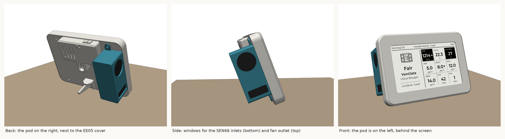

# SEN66 side-pod for the EE05 + 4.26" enclosure

An add-on housing that mounts a Sensirion SEN66 on the back of the EE05 / 4.26" e-paper
enclosure (the "Cattt Casing": EN05 frame, support, back plate, back cap, stand, switch cap).
None of the original parts need reprinting. You only need one cable hole in the back plate.

- **`sen66_pod.stl`**: ready to print, already in print orientation.
- **`make_pod.py`**: generates the pod, and optionally modified copies of the original back plate (cable hole, M3 clearance holes), frame (M3 insert holes) and display support (M2 insert holes).



## How it fits

- The pod sits on the back plate beside the EE05 pocket, on the **right when you look at the back**
  of the case (the left when you look at the screen). It is held on by the **two existing
  back-plate screws on that side**, which pass through tabs on the pod.
- The SEN66 lies on its side with its inlets and outlet facing sideways through two windows in the
  pod's outer wall: inlets at the bottom, fan outlet at the top. Sensirion's guidelines allow
  sideways-facing openings, the solid wall between the windows keeps inlet and outlet air apart, and
  most of the sensor sits below the EE05 (the ESP32 is the main heat source).
- The sensor cable leaves through the channel under the sensor and goes into the case through one
  hole in the back plate.
- Checked against the original STLs: no overlap with any part, and about 2 mm of clearance from
  the desk when the case leans back on its stand (about 20°).

## Hardware

These sizes come from the designer's STEP assembly (EE05_4_26.step, on Seeed's GrabCAD), the STLs
and the EE05's PCB file. The designer's model uses four M2.5 button-head screws (McMaster 92095A113)
for the case, going through the back plate into the frame's bosses, and doesn't show any screws for
the EE05. There are two ways to build it.

**With heat-set inserts (recommended; the threads survive repeated opening).** Print the frame and
display support that `make_pod.py --frame ... --support ...` generates. They have holes sized to
CNC Kitchen's guidelines.

| Qty | Part | Goes |
| --- | --- | --- |
| 4 | **M3 × 5.7 heat-set insert** (hole 4.0 × 6.7 mm) | Into the frame's four screw bosses, from the back |
| 4 | **M2 × 3 heat-set insert** (hole 3.2 × 4.5 mm) | Into the display support's four EE05 posts |
| 2 | **M3 × 8 mm** machine screw, pan or button head | Back plate to frame: the two screws on the left, seen from the back |
| 2 | **M3 × 10 mm** machine screw, pan or button head | Through the pod's tabs and the back plate into the frame |
| 4 | **M2 × 5 mm** machine screw (M2 × 4 to M2 × 6 all fit) | EE05 board onto its posts |

- Press each insert in straight with a soldering iron at your usual insert temperature for the
  filament, until it's flush with, or just below, the top of the boss.
- The walls around the inserts are 1.9 mm for M3 and 1.5 mm for M2, above CNC Kitchen's minimums
  of 1.6 mm and 1.3 mm.
- The original hole continues below each insert hole, so the screw tips have room.
- **If your holes print undersize** (common with FDM), measure one and regenerate with the
  difference, e.g. `--hole-comp 0.5` when a 4.0 mm hole measures 3.5 mm. It enlarges every screw
  and insert hole (frame, support, back plate and pod tabs). With 0.5 the walls are still 1.6 mm
  (M3) and 1.4 mm (M2). Alternatively, use your slicer's hole compensation setting (not both).

**Without inserts, using the original frame and support (as the designer intended).** M2.5 screws
cut their own thread in the 2.5 mm printed bosses; printed holes come out slightly undersize.
Screws made for plastic ("PT" or thread-forming) grip best:

| Qty | Screw | Goes |
| --- | --- | --- |
| 2 | **M2.5 × 6 mm** button head | Back plate to frame: the two on the left, seen from the back |
| 2 | **M2.5 × 8 mm** button head | Through the pod's tabs |
| 4 | **M2 × 6 mm** | EE05 board onto the display support (2.0 mm pilot holes, 10 mm deep) |

The designer's model shows M2.5 × ~3 mm screws, which only reach about 1 mm into the bosses. The
lengths above give 4 mm of thread.

**Either way:**
- The frame's bosses are 8 mm across with 2.5 mm holes, 8.2 mm deep. The EE05's mounting holes are
  2.5 mm (M2 clearance), 27 × 21 mm apart, and line up with the display support's posts.
- The back plate generated here has 3.2 mm screw holes, for M3 through the inserts. M2.5 button
  heads also clamp fine through them. If you print the original back plate with M3 screws, drill
  its four holes out to 3.2 mm (a 1/8" bit is fine).
- The back cap, stand and switch cap have no screw holes.
- **EE05 orientation:** in the designer's model the board sits on the four posts with its components
  facing the back cover. Its labelled side, with the pad names, faces the display, so solder the
  sensor wires before screwing the board in.
- **Battery (optional):** the design has room for a 62.5 × 40.5 × 7 mm LiPo behind the lower half of
  the display. The pod's cable hole is clear of it by about 5 mm. The SEN66's fan runs all the
  time, so plan on USB power anyway.

## Printing

- Print `sen66_pod.stl` as is (tabs flat on the bed). No supports: the back wall bridges 22 mm.
- 0.2 mm layers, 3 walls, PLA or PETG.

## Assembly

1. **Cable hole.** Either
   - drill a ~9 mm hole in the back plate. Looking at the outside of the back plate (from behind
     the case), it's centred on the line between the two right-hand screw holes, ~1 mm below
     halfway between them: 17.5 mm in from the right-hand edge and 43 mm down from the top edge.
     Or
   - generate a back plate with the hole (and 3.2 mm screw holes) already in it:
     `python make_pod.py --backplate "Backplate.stl"`
2. Feed the bare-wire end of the SEN66 cable through the hole from the outside and plug the
   connector into the sensor. Route the cable through the channel under the sensor.
3. Put the SEN66 into the pod with its inlet/outlet face against the windows (round fan outlet in
   the top window) and the connector side against the inner wall.
4. Put the pod, with the sensor in it, onto the back plate and fix it with the two screws on that
   side (the right, seen from the back): **M3 × 10**, 2 mm longer than the others because of the
   2 mm tabs.
5. Seal the hole around the cable from the inside with a bit of Blu-Tack, so the SEN66 can't draw
   air from inside the case.
6. Optional: a strip of thin foam tape on the sensor face between the inlets and the outlet
   improves the seal against the pod wall.

## Regenerating / tweaking

```
pip install trimesh manifold3d numpy
python make_pod.py [--backplate Backplate.stl] [--frame "EN05 frame thick.stl"] [--support support.stl] [--hole-comp 0.5] [--assembly]
```

All dimensions (wall thickness, clearance, tab size, screw hole size, pod position) are
constants at the top of `make_pod.py`. `--assembly` also writes the pod in the enclosure's
assembly coordinates, so you can load it together with the original STLs to check the fit.

This pod is designed from measurements of the enclosure STLs and the SEN66 datasheet. It hasn't
been test-printed yet, so print it and dry-fit it before final assembly.
